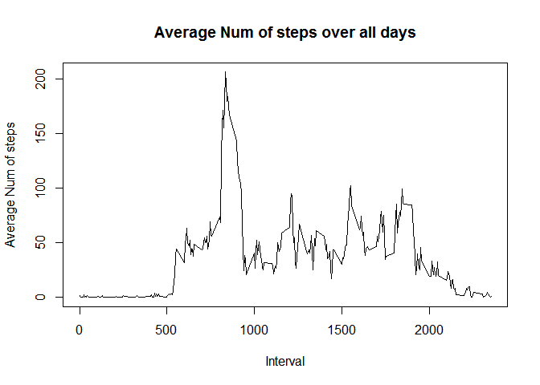

# Reproducible Research: Peer Assessment 1


```r
library(dplyr)
```

```
## Warning: package 'dplyr' was built under R version 3.2.3
```

```
## 
## Attaching package: 'dplyr'
```

```
## The following objects are masked from 'package:stats':
## 
##     filter, lag
```

```
## The following objects are masked from 'package:base':
## 
##     intersect, setdiff, setequal, union
```

```r
library(ggplot2)
```

```
## Warning: package 'ggplot2' was built under R version 3.2.3
```

## Loading and preprocessing the data

```r
unzip(zipfile="activity.zip")
data_row <- read.csv('activity.csv')

# Remove NA in data

data <- data_row[ with (data_row, { !(is.na(steps)) } ), ]
```

## What is mean total number of steps taken per day?

```r
# Calculate the total number of steps taken per day
steps_by_day <- summarise(group_by(data, date), total = sum(steps))
steps_by_day
```

```
## Source: local data frame [53 x 2]
## 
##          date total
##        (fctr) (int)
## 1  2012-10-02   126
## 2  2012-10-03 11352
## 3  2012-10-04 12116
## 4  2012-10-05 13294
## 5  2012-10-06 15420
## 6  2012-10-07 11015
## 7  2012-10-09 12811
## 8  2012-10-10  9900
## 9  2012-10-11 10304
## 10 2012-10-12 17382
## ..        ...   ...
```

```r
#If you do not understand the difference between a histogram and a barplot, research the difference between them. Make a histogram of the total number of steps taken each day

hist(steps_by_day$total, main="Histogram of total number of steps taken per day", 
     xlab="Total number of steps in a day")
```


```r
#Calculate and report the mean and median of the total number of steps taken per day
mean(steps_by_day$total)
```

```
## [1] 10766.19
```

```r
median(steps_by_day$total)  
```

```
## [1] 10765
```

## What is the average daily activity pattern?

```r
#Make a time series plot (i.e. type = “l”) of the 5-minute interval (x-axis) and the average number of steps taken, averaged across all days (y-axis)
avg_act <- aggregate(steps ~ interval, data, mean)
plot(avg_act$interval,avg_act$steps,type = "l",xlab="Interval",ylab="Average Num of steps", main="Average Num of steps over all days")
```



```r
# Which 5-minute interval, on average across all the days in the dataset, contains the maximum number of steps?
avg_act[which.max(avg_act$steps),]
```

```
##     interval    steps
## 104      835 206.1698
```


## Imputing missing values

```r
#Calculate and report the total number of missing values in the dataset (i.e. the total number of rows with NAs)
sum(is.na(data_row))
```

```
## [1] 2304
```

```r
#Devise a strategy for filling in all of the missing values in the dataset. The strategy does not need to be sophisticated. For example, you could use the mean/median for that day, or the mean for that 5-minute interval, etc.
##Create a new dataset that is equal to the original dataset but with the missing data filled in.
imputed_data <- data_row

for (i in 1:nrow(imputed_data)) {
  if (is.na(imputed_data$steps[i])) {
    interval_value <- imputed_data$interval[i]
    steps_value <- avg_act[
      avg_act$interval == interval_value,]
    imputed_data$steps[i] <- steps_value$steps
  }
}

#Make a histogram of the total number of steps taken each day and Calculate and report the mean and median total number of steps taken per day. Do these values differ from the estimates from the first part of the assignment? What is the impact of imputing missing data on the estimates of the total daily number of steps?
imputed_data_by_day <- aggregate(steps ~ date, imputed_data, sum)
hist(imputed_data_by_day$steps, main="Histogram of total number of steps per day (imputed)", 
     xlab="Total number of steps in a day")
```


```r
## the Mean
mean(imputed_data_by_day$steps)
```

```
## [1] 10766.19
```

```r
## the Median
median(imputed_data_by_day$steps)
```

```
## [1] 10766.19
```
Mean values are the same but therer is small difference in meadian value


## Are there differences in activity patterns between weekdays and weekends?

```r
#Create a new factor variable in the dataset with two levels – “weekday” and “weekend” indicating whether a given date is a weekday or weekend day.
imputed_data['day_name'] <- weekdays(as.Date(imputed_data$date))
imputed_data['day_type']<- as.character()
imputed_data$day_type[imputed_data$day_name  %in% c('Saturday','Sunday')] <- "weekend"
imputed_data$day_type[imputed_data$day_name  %in% c("Monday", "Tuesday", "Wednesday", "Thursday", "Friday")] <- "weekday"
imputed_data$day_type <- as.factor(imputed_data$day_type)
imputed_data_by_interval<-aggregate(steps ~ interval + day_type, imputed_data, mean)
##Plot
qplot(interval,steps, data = imputed_data_by_interval,  geom=c("line"),  xlab="Interval",       ylab = "Number of steps",main = "Average number of steps taken on weekdays and weekends")+facet_wrap(~ day_type, ncol = 1)
```


